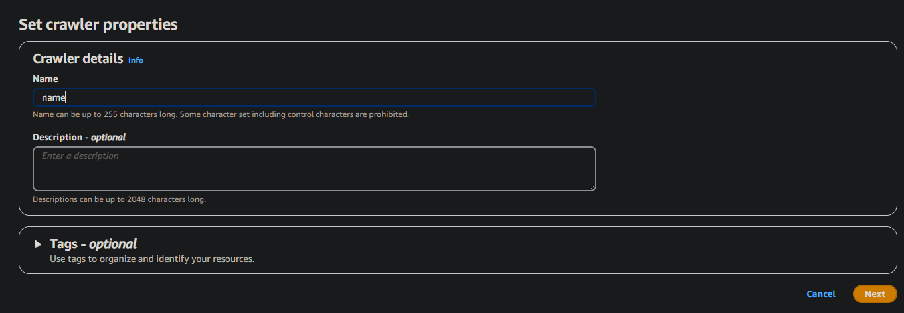
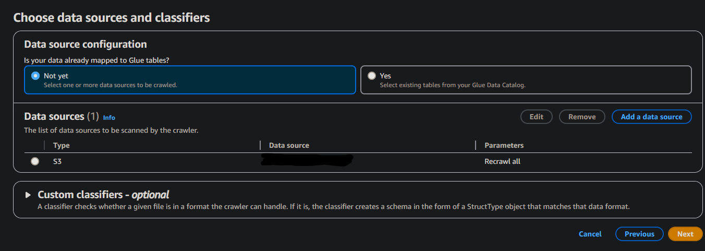
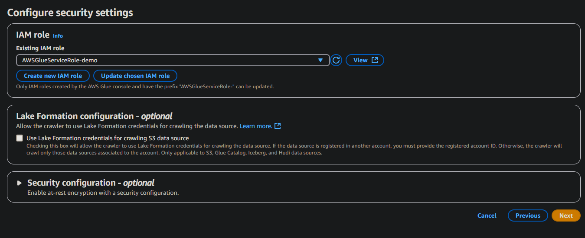
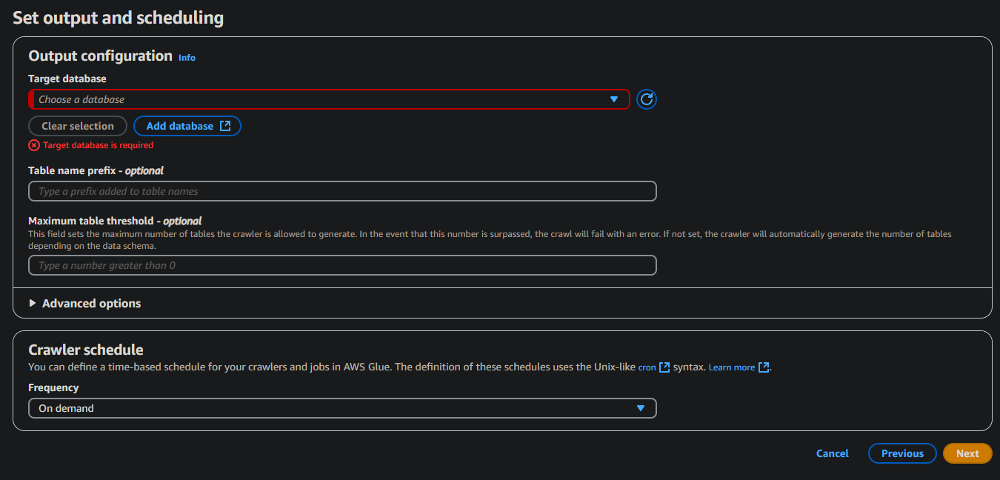
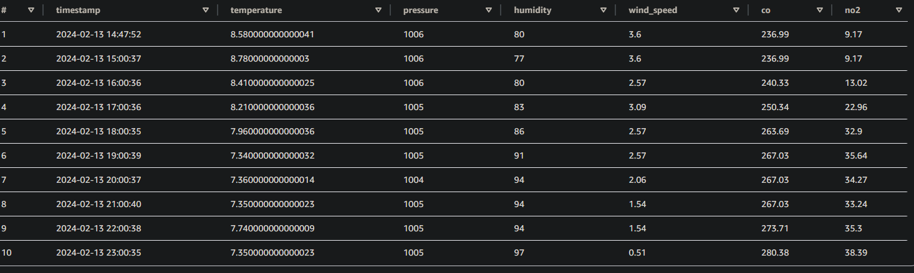
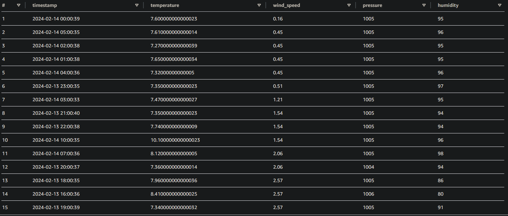
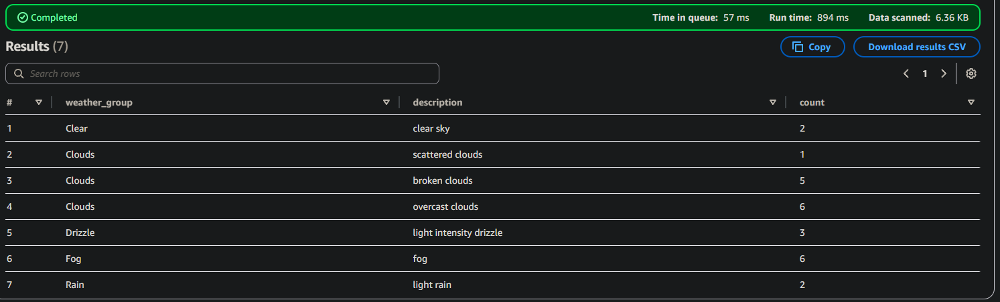

# AWS Athena and Glue Crawlers
Athena is a tool for carrying out analysis on a variety of data sources, one of the simplest ways being to use the SQL query editor on a local data source, such as an S3 bucket. This directory is an example of such a use case, building on the Airflow project that can also be found in this repo.
## Description
This will be a bit different from my other projects, at is is primarily carried out via the AWS UI. It will also assume that you have used the weather_csv_dag method, creating a csv and storing it in an S3 bucket.

# Getting the data
The first step is to actually retrieve the data from our bucket, for which we will use a Crawler. This will look through your bucket, and add the information from the csv into a database.

The setup is very straightforward. From the AWS Glue hub, go to the Database tab, and create a new database. You can just enter a name, and leave the rest of the options be.

From there, move to the Tables tab, and click Add Tables using Crawler. This will allow you to create a crawler, and run it immediatley to set up your table.

Most of the options can be left be - you just need to give the crawler a unique name, point it towards your bucket, create an IAM role to grant it permission to access your bucket (which can be done automatically by AWS), and select the database you wish to add the table to. You can also set up a schedule for the crawler, if you want it to run regularly.

# Using your data
Now that the data is in Glue, you can perform a number of operations on it. In this instance, we will be running some basic SQL queries, monitoring the changes in weather conditions over a period of roughly 1 day. You could run a script for longer, and over a larger or shorter interval, but this will affect how much the service costs you. 

As bucket names are global, I will be using the term {name} to refer to the name of your bucket. Also, all outputs will limit the number of rows for the sake of readability

First, a query to simply display data as it appears in the table, sorted by timestamp

`SELECT timestamp, temperature,pressure, humidity, wind_speed, co, no2 FROM {name}    
LIMIT 10;`

Next, one to see when the wind was strongest, sorting by wind speed

`select timestamp, temperature, wind_speed, pressure, humidity from {name}
ORDER BY wind_speed
Limit 15;`

Finally, a look at how often certain weather conditions occured throughout the day

`select weather_group, description, COUNT(*) as count from knightblue_weather
GROUP BY weather_group, description
ORDER BY weather_group;`

These are just a few examples, and simple ones at that, but it does show the simplicty of the process, from acquisition of data to analysis.

In addition, Athena also allows for the use of multiple saved queries, and saved views, as opposed to other SQL UIs that do not allow for such features, keeping everything in one page.